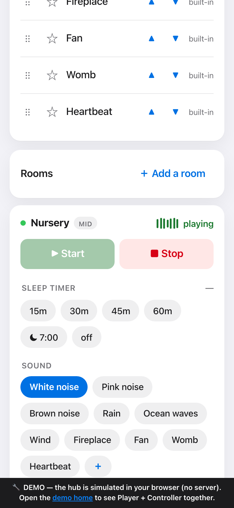
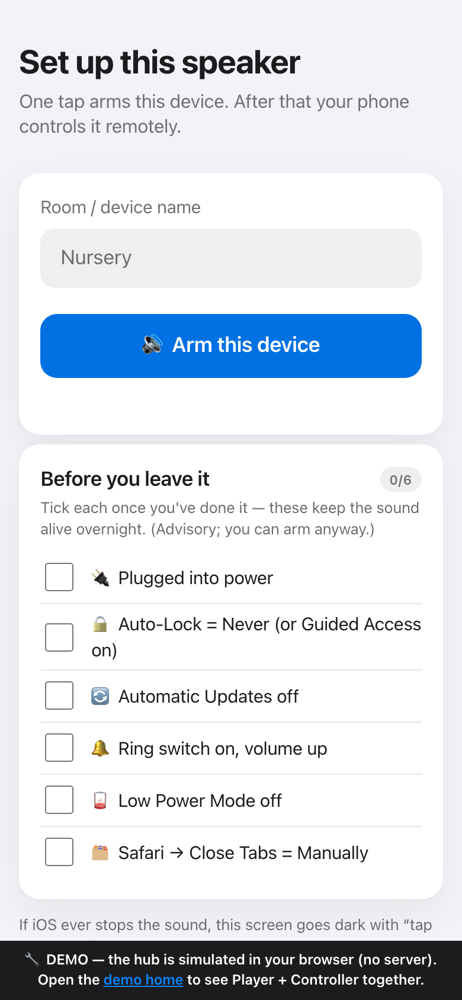

<div align="center">

# 🌙 Lull

**Turn the old iPhones and iPads in your drawer into nursery white‑noise speakers you run from your own phone.**

Web tech only — no App Store, no native build, nothing to install. Open it, tap once, there's sound.

[**▶ Try the live demo**](https://lifeart.github.io/lull/) &nbsp;·&nbsp; [Features](#features) &nbsp;·&nbsp; [Run it](#run-it) &nbsp;·&nbsp; [How it works](#how-it-works) &nbsp;·&nbsp; [Deploy](docs/DEPLOY.md)

[](https://github.com/lifeart/lull/actions/workflows/ci.yml)
-brightgreen)


[](LICENSE)

</div>

<p align="center">
  
  &nbsp;&nbsp;
  
</p>

## What it is

A phone that's "too old for the App Store" is still a perfectly good speaker. **Lull** gives it a job: arm each old device once with a tap, and it becomes a nursery white‑noise speaker you control from your current phone — start, stop, volume, sleep timer, switch sounds, one tap for every room.

**No account. No subscription. No cookie banner. No "welcome, let us tell you our story."** At 3 a.m. you shouldn't have to search a library, dismiss three pop‑ups, and accept a privacy policy to calm a crying baby. You tap once — there's sound.

It runs on one codebase from **iOS 10.3 to today** (feature‑detected, no build step), needs **one tiny always‑on hub** (a single Node process, one dependency), and keeps the audio *honest* — which is the whole trick, below.

## Features

- 🔊 **Always‑audible by design** — a seamless looping `<audio>` file that keeps playing through screen lock (the one iOS‑safe audio path); your phone starts / stops / fades / times it remotely.
- 🎚 **10 sounds, loudness‑matched** — white · pink · brown noise + rain · ocean · wind · fireplace · fan · womb · heartbeat, all normalized to **−16 LUFS** so switching never jumps in volume. **Pink is the default.**
- 🌧 **Real recordings, optionally** — `npm run fetch:real` overlays vetted **CC0 / public‑domain field recordings** for rain / ocean / fire / wind (downloaded audio stays out of git; the synthesized loops are the offline fallback).
- ⏲ **Bedtime in one tap** — start every room at once; a **~45‑min wind‑down sleep timer is on by default**.
- 👶 **Baby monitor** — an opt‑in mic “cry meter” sends the room's sound level back to your phone, with an alert on a sustained spike.
- 🛎 **Fails loud, on the *awake* phone** — every command must ACK within ~3 s; a bedtime pre‑flight won't show green until every room answers; a dead speaker sets off a loud alarm on *your* phone, so 3 a.m. failures are caught before bed.
- 📱 **Installable PWA** — add each app to the home screen; runs standalone (no browser chrome).
- ➕ **Your own sounds** — drag‑drop or upload a lullaby/recording; it becomes a selectable sound on every device.
- 🧩 **One tiny hub** — a single Node process, one runtime dependency (`ws`); runs on a Raspberry Pi / NAS / spare laptop, or reach it from anywhere via a **Cloudflare Tunnel**.
- 🔐 **Locked down** — Origin allowlist + an `MP_TOKEN` shared secret gate every command and upload; the hub **fails closed** on a public bind.
- 👨‍👩‍👧 **One hub, many families** — flip on multi‑family mode (`MP_MULTIGROUP=1`) and each household uses its own token; every token is a fully **isolated group** — its own rooms, controls, and uploaded sounds — with no accounts and no server‑side registry.
- 🧪 **149 tests** (119 Node + 30 real‑browser Playwright), green in CI on every push.

## The one thing to understand first

iOS **will not let a web page start audio on a locked, idle device from a network message or a push.** Audio needs a one‑time user *tap* to unlock, and a backgrounded Safari tab gets suspended (killing its connection) unless audio is *actively playing*.

So Lull does **not** try to "wake a silent iPad and make it play." Instead:

1. **Arm each device once** with a single tap — that unlocks audio and starts a seamless loop that **keeps playing**.
2. Your phone then **starts / stops / fades / sets a sleep timer** remotely, because the always‑running audio keeps the device reachable.
3. Reliability comes from **detecting failures on your (awake) phone and alarming you** — never from magically reviving a dead nursery device at 3 a.m.

That honesty *is* the design. Pretending otherwise would just be a product that fails at the worst possible moment.

## Run it

```bash
npm install                       # one runtime dependency: ws
npm run bake                      # 10 seamless −16 LUFS loops + PNG app icons (pure Node, no ffmpeg)
npm start                         # hub on http://localhost:8080   (localhost is a secure context)
```

Open **`http://localhost:8080/player/`** in one tab → name it, tap **Arm**. Open **`/controller/`** in another → drive it: start/stop, volume, timer, switch sounds.

```bash
npm test                          # 119 Node tests (protocol, seams, audio engine, hub, auth, store, multi-group…)
npx playwright install chromium   # once
npm run test:e2e                  # 30 real-browser tests
npm run fetch:real                # (optional) swap in real CC0/PD recordings for rain/ocean/fire/wind
npm run serve:demo                # build + serve the static demo locally
```

## How it works

```
     Parent's phone                   Always-on hub                  Old iPad (nursery)
┌──────────────────────┐         ┌──────────────────────┐         ┌──────────────────────┐
│ Controller PWA       │         │ Hub (Node + ws)      │         │ Player PWA           │
│ • start / stop       │         │ • serves both PWAs   │         │ • looping <audio>    │
│ • volume · timer     │   ──>   │ • desired / reported │   ──>   │ • Web Audio gain     │
│ • sleep timer        │   <──   │ • hub-owned timer    │   <──   │ • MediaSession       │
│ • the alarm          │         │ • single source      │         │ • auto-reconnect     │
└──────────────────────┘         └──────────────────────┘         └──────────────────────┘
```

*→ commands (each needs an ACK within ~3 s) &nbsp;·&nbsp; ← state (desired intent vs. reported telemetry)*

- **Hub** — a tiny always‑on box; serves both apps over HTTPS, relays commands, and is the single source of truth (`desired` intent vs. `reported` telemetry, stored as an atomic JSON file).
- **Player PWA** (`/player/`) — the "speaker" on each old device.
- **Controller PWA** (`/controller/`) — the remote on the parent's phone.
- **Shared protocol** (`shared/protocol.js`) — one wire contract imported by all three, so no layer can disagree on verbs/units/state.

The full architecture, the verified iOS constraints, and the capability tiers (iOS 10.3 → 18) are in [`docs/DESIGN.md`](docs/DESIGN.md).

## Live demo

The [demo](https://lifeart.github.io/lull/) runs the **unmodified apps against an in‑browser mock hub** (a leader‑elected `BroadcastChannel` hub running the real protocol) — so the two apps genuinely talk to each other with **no server**:

- **`/`** — the intro + an embedded, playable Speaker + Controller.
- **`/live/`** — the two apps full‑screen.
- **`/rtc/`** — the same apps running **peer‑to‑peer over a real `RTCDataChannel`** (a WebRTC‑transport prototype).

It demonstrates the control plane, tiers, timer, and parent‑phone alarm; it can't reproduce true iOS background/lock behavior — that needs a real device (see limits below).

## Deploy

- **On your LAN** — run the hub on an always‑on box; open it on your devices over HTTPS.
- **From anywhere** — a **Cloudflare Tunnel** gives it a public HTTPS URL with no port‑forwarding.
- **Auth** — set `MP_TOKEN` (`openssl rand -hex 24`) and open the apps once with `…/controller/#t=YOUR_TOKEN` (remembered per device); the hub won't start open on a public interface.
- **Many families, one hub** — set `MP_MULTIGROUP=1` and give each household its own token; open their apps with `…/controller/#t=FAMILY_TOKEN`. Every distinct token becomes a fully **isolated group** — separate rooms, controls, and uploaded sounds — with no accounts and no server‑side registry (the group id is a hash of the token). Existing single‑token setups are unaffected (leave the flag off).

Full topology matrix (LAN · tunnel · "GitHub Pages + WebRTC vs. a standalone hub"), public‑exposure auth, and a step‑by‑step Synology recipe are in **[`docs/DEPLOY.md`](docs/DEPLOY.md)** and [`docs/DEPLOY-SYNOLOGY.md`](docs/DEPLOY-SYNOLOGY.md).

## Honest limits

- **No cold‑start from silence on a locked old device.** Over an 8‑hour night iOS can reclaim an idle tab; after any reload, audio is re‑locked and needs a physical tap no remote command can supply. Lull is built around this, not against it.
- **Old/1 GB devices are best‑effort / attended.** Capability tiers degrade honestly; the app tells you what a given device can and can't do.
- **Not yet run on a real‑iOS overnight soak** — the one make‑or‑break unknown; harden each device ([`docs/HARDENING.md`](docs/HARDENING.md)) and run the [overnight test](docs/OVERNIGHT-TEST.md) before trusting it unattended.

## Why not AirPlay / Chromecast / a native app?

- **iOS devices can't *receive* AirPlay** — they only send it. You can't AirPlay *to* an old iPhone.
- **A native app** means rebuilding and re‑signing per iOS version and device — exactly what old hardware makes painful.
- **Web tech** covers iOS ~10.3 → current from one codebase (no build step); the price is the background‑audio constraints above, which the design turns into a feature.

*Prior art worth knowing:* **Snapcast + Snapweb** and **Home Assistant + Music Assistant** already solve server‑controlled browser audio if you're happy to self‑host them. Lull is the from‑scratch, purpose‑built take on the old‑iOS‑as‑nursery‑speaker case.

## Docs

| Doc | What's in it |
|---|---|
| [`docs/DESIGN.md`](docs/DESIGN.md) | Architecture, the iOS constraints that shape it, capability tiers, the protocol |
| [`docs/DEPLOY.md`](docs/DEPLOY.md) | Deployment matrix, tunnel + public‑exposure auth |
| [`docs/HANDOFF.md`](docs/HANDOFF.md) | Current status, run/test/deploy, architecture map, invariants |
| [`docs/HARDENING.md`](docs/HARDENING.md) · [`docs/OVERNIGHT-TEST.md`](docs/OVERNIGHT-TEST.md) | Per‑device setup + the overnight soak gate |
| [`docs/RESEARCH-SOUND-SCIENCE.md`](docs/RESEARCH-SOUND-SCIENCE.md) | Evidence‑based baby‑sleep sounds + synthesis recipes |

---

## License

[MIT](LICENSE) — do what you like with the code. (The optional field recordings pulled in by
`npm run fetch:real` are CC0 / public‑domain, fetched separately and never committed here.)

<div align="center">
MIT‑licensed &nbsp;·&nbsp; give the old phones in your drawer a second life. 🌙
</div>
